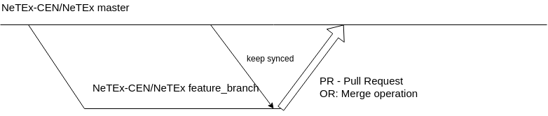

## NeTEx GIT workflow?

---

## Example workflow

Example workflows for forked repositories


---

## Example workflow when you own the repository



Still possible to use a private fork if desirable

---

## Guidelines

* Keep feature branches small and manageable
* Easier to review
* Easier to see the difference with `git diff`
* Easier to revert (if required)
* It is easier to accept one feature without other non relevant changes

---

## Guidelines #2
* When creating a new feature branch, make sure it's created from the latests changes in the NeTEx CEN master repository
* Keep the feature branch updated when working on it to detect and handle conflicts at an early stage
* Clear and descriptive commit messages makes it easier to understand why something was changed
* Validate all pull requests (already available in the CEN repo)

---

## Set up private key
It may not be necesarry but helps a lot when working with git, as you do not have to authenticate for every commit. This guide explains the process for mac/windows/linux:

https://help.github.com/articles/adding-a-new-ssh-key-to-your-github-account/#platform-windows

---

## Use the command line for git

There are many tools for git. But most examples and guides on the internet are using command line.

Download git:
https://git-scm.com/downloads

---

## Git clone

Clone the repository

```
git clone https://github.com/NeTEx-CEN/NeTEx.git
```
```
cd NeTEx
```

---

## Checkout a feature branch

Remember: always pull from master before creating a new branch.
This ensures that changes are made on recent changes, and avoids merging issues later.
```
git pull
```

Example creating a branch from the master branch. Example branch name: *journey_frequency_group_id_constraint_check*
```
git checkout master -b journey_frequency_group_id_constraint_check
```

---

## Push that feature branch up remotely

```
git push --set-upstream origin journey_frequency_group_id_constraint_check
```
This allows other to follow your work.
If the laptop dies, the work will not be lost if changes were commited and pushed.

---

## Prepare to do some changes
* First, make sure that you do not have uncommited changes before changing anything (this is not required when you just created the branch):
```
git status
```
* Then make sure your feature branch is up to sync with the master branch
```
git fetch
git merge master
```

---

## Do some changes in the feature branch
* Change files relevant to the feature branch
* To see what changes that have been done, execute `git diff`
* Add the file or files you want to commit:
```
git add examples/functions/calendar/NeTEx_Calendar_se_PA1.xml
```
* Commit with a descriptive message:
```
git commit -m "Fix NeTEx calendar example so that it validates against schema."
```
* Push the changes remotely (default origin)
```
git push
```

---

## Check the Travis build status
Travis build status is available as Github checks:
https://github.com/NeTEx-CEN/NeTEx/branches

---

## Get the feature branch into master by merging

Just merge it into master using git commands
```
git checkout master
git pull
git merge journey_frequency_group_id_constraint_check
git push
```

---

## Get feature branch into master by creating PR
* Log into github
https://github.com/NeTEx-CEN/NeTEx/branches
* Find your branch
* Click "New pull request"

See the following guide:
https://services.github.com/on-demand/github-cli/open-pull-request-github

---

## From the github guide


---

## What remotes do I have?
*Side note:* You can see what remotes you have by issuing the command:
```
git remote -vv
```

I have multiple remotes, the following is the output for NeTEx-CEN:
```
NeTEx-CEN	https://github.com/NeTEx-CEN/NeTEx.git (fetch)
NeTEx-CEN	https://github.com/NeTEx-CEN/NeTEx.git (push)
nick-knowles	https://github.com/nick-knowles/NeTEx.git (fetch)
nick-knowles	https://github.com/nick-knowles/NeTEx.git (push)
origin	git@github.com:entur/NeTEx.git (fetch)
origin	git@github.com:entur/NeTEx.git (push)
```

---

## How to solve merge conflicts
Some times when doing `git pull` merge conflicts will happen.
This is solved by fixing the issues and doing the usual `git commit`.
Sometimes it can be required to do `git merge --continue`.
More information here:
https://help.github.com/articles/resolving-a-merge-conflict-using-the-command-line/

---

### Git commands listed

```
git pull
git checkout master -b journey_frequency_group_id_constraint_check
git push --set-upstream origin journey_frequency_group_id_constraint_check
# Change example file
git add examples/functions/calendar/NeTEx_Calendar_se_PA1.xml
git commit -m "Fix NeTEx calendar example so that it validates against schema."
git push
# Remember to create PR
```

---

### Links
This presentation can be found here:
https://gitpitch.com/csolem/netex-cen-git-workflow#/

The presentation happens to be on github too:
https://github.com/csolem/netex-cen-git-workflow#/
